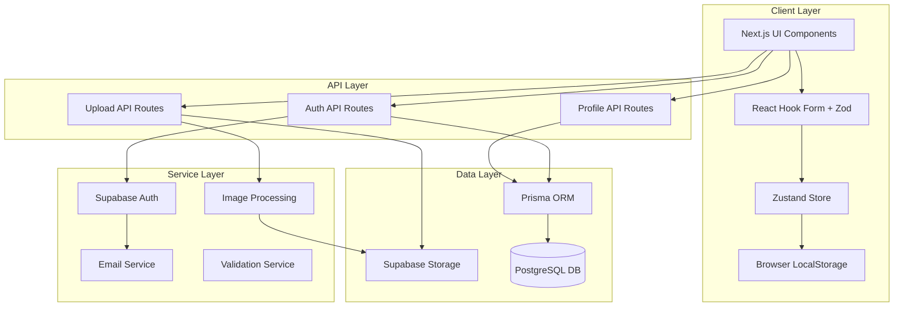
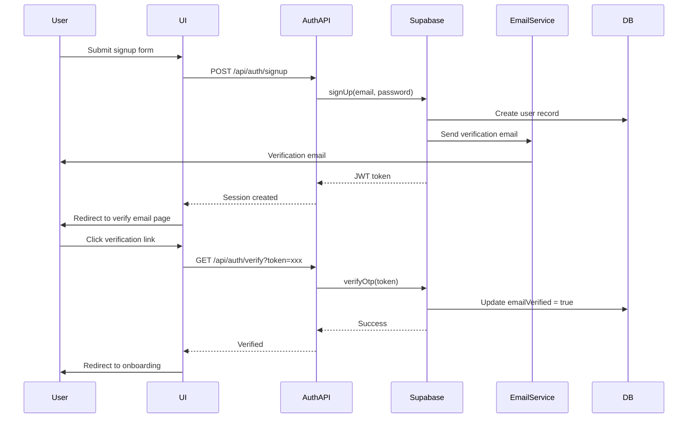
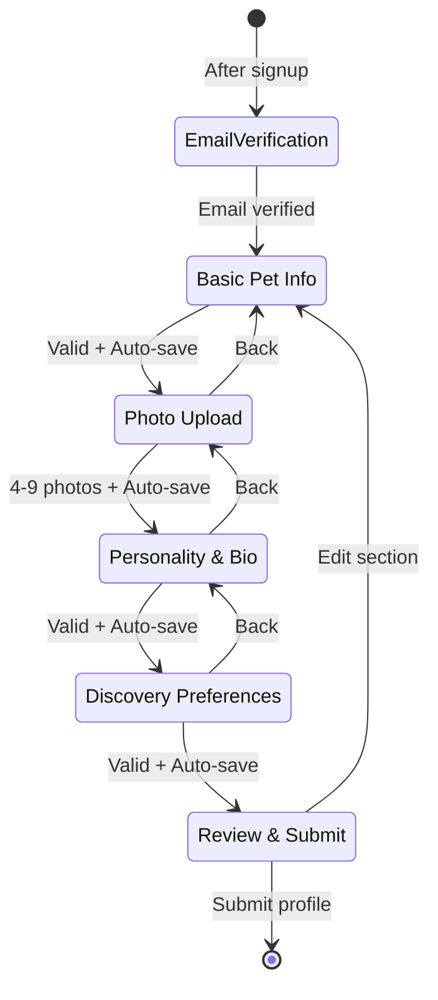

# Design Document: Authentication and Pet Profile Onboarding

## Overview

This design document outlines the technical architecture for the authentication and pet profile onboarding feature in Kanya, a pet dating app. The system enables users to create secure accounts, verify their email addresses, and complete a guided multi-step wizard to create their first pet profile.

The implementation leverages Next.js 14 App Router with TypeScript, Supabase for authentication and storage, Prisma ORM for database operations, React Hook Form with Zod for validation, and Zustand for state management. The design prioritizes security, user experience, and mobile responsiveness while maintaining code quality and testability.

**Key Design Goals:**
- Complete onboarding in under 2 minutes
- Achieve >80% profile completion rate
- Secure authentication with industry-standard practices
- Seamless multi-step form experience with auto-save
- Optimized image uploads with compression
- Mobile-first responsive design

## Architecture

### High-Level Architecture



### Authentication Flow



### Onboarding Flow



## Components and Interfaces

### 1. Authentication Components

#### SignupForm Component
```typescript
interface SignupFormProps {
  onSuccess: (userId: string) => void;
  onError: (error: Error) => void;
}

interface SignupFormData {
  email: string;
  password: string;
  confirmPassword: string;
}

// Zod schema for validation
const signupSchema = z.object({
  email: z.string().email("Invalid email format"),
  password: z.string()
    .min(8, "Password must be at least 8 characters")
    .regex(/[A-Z]/, "Password must contain uppercase letter")
    .regex(/[a-z]/, "Password must contain lowercase letter")
    .regex(/[0-9]/, "Password must contain number"),
  confirmPassword: z.string()
}).refine((data) => data.password === data.confirmPassword, {
  message: "Passwords must match",
  path: ["confirmPassword"]
});
```

#### LoginForm Component
```typescript
interface LoginFormProps {
  onSuccess: (userId: string) => void;
  onError: (error: Error) => void;
  redirectUrl?: string;
}

interface LoginFormData {
  email: string;
  password: string;
}

const loginSchema = z.object({
  email: z.string().email("Invalid email format"),
  password: z.string().min(1, "Password is required")
});
```

#### EmailVerification Component
```typescript
interface EmailVerificationProps {
  userId: string;
  email: string;
}

interface VerificationState {
  status: 'pending' | 'verifying' | 'verified' | 'error';
  canResend: boolean;
  resendCooldown: number; // seconds
}
```

### 2. Onboarding Wizard Components

#### OnboardingWizard Container
```typescript
interface OnboardingWizardProps {
  userId: string;
  onComplete: (petId: string) => void;
}

interface WizardState {
  currentStep: number;
  totalSteps: number;
  formData: Partial<PetProfileFormData>;
  isDirty: boolean;
  isSubmitting: boolean;
}

interface PetProfileFormData {
  // Step 1: Basic Info
  name: string;
  species: 'dog' | 'cat' | 'bird' | 'rabbit' | 'other';
  breed: string;
  birthday: Date;
  gender: 'male' | 'female' | 'neutered' | 'spayed';
  size: 'small' | 'medium' | 'large' | 'giant';
  
  // Step 2: Photos
  photos: PhotoData[];
  
  // Step 3: Personality & Bio
  personality: string[];
  bio: string;
  
  // Step 4: Discovery Preferences
  preferences: {
    maxDistance: number; // miles
    speciesFilter: string[];
    ageRange: { min: number; max: number };
  };
}

interface PhotoData {
  id: string;
  file: File;
  preview: string;
  uploadUrl?: string;
  order: number;
}
```

#### Step1: BasicInfoForm
```typescript
const step1Schema = z.object({
  name: z.string()
    .min(1, "Pet name is required")
    .max(50, "Pet name must be under 50 characters"),
  species: z.enum(['dog', 'cat', 'bird', 'rabbit', 'other']),
  breed: z.string().min(1, "Breed is required"),
  birthday: z.date()
    .max(new Date(), "Birthday cannot be in the future")
    .refine((date) => {
      const sixMonthsAgo = new Date();
      sixMonthsAgo.setMonth(sixMonthsAgo.getMonth() - 6);
      return date <= sixMonthsAgo;
    }, "Pet must be at least 6 months old"),
  gender: z.enum(['male', 'female', 'neutered', 'spayed']),
  size: z.enum(['small', 'medium', 'large', 'giant'])
});

// Breed options by species
const breedOptions: Record<string, string[]> = {
  dog: ['Labrador', 'Golden Retriever', 'German Shepherd', 'Bulldog', 'Mixed Breed', ...],
  cat: ['Persian', 'Siamese', 'Maine Coon', 'Bengal', 'Mixed Breed', ...],
  bird: ['Parrot', 'Cockatiel', 'Budgie', 'Canary', ...],
  rabbit: ['Holland Lop', 'Netherland Dwarf', 'Flemish Giant', ...],
  other: ['Other']
};
```

#### Step2: PhotoUploadForm
```typescript
const step2Schema = z.object({
  photos: z.array(z.object({
    id: z.string(),
    file: z.instanceof(File),
    preview: z.string(),
    order: z.number()
  }))
  .min(4, "At least 4 photos required")
  .max(9, "Maximum 9 photos allowed")
});

interface PhotoUploadProps {
  photos: PhotoData[];
  onPhotosChange: (photos: PhotoData[]) => void;
  maxPhotos: number;
  minPhotos: number;
}

// Photo validation
const validatePhoto = (file: File): string | null => {
  const validTypes = ['image/jpeg', 'image/png', 'image/webp'];
  const maxSize = 10 * 1024 * 1024; // 10MB
  
  if (!validTypes.includes(file.type)) {
    return 'Only JPEG, PNG, and WebP formats are supported';
  }
  
  if (file.size > maxSize) {
    return 'File size must be under 10MB';
  }
  
  return null;
};
```

#### Step3: PersonalityBioForm
```typescript
const step3Schema = z.object({
  personality: z.array(z.string())
    .min(3, "Select at least 3 personality traits")
    .max(8, "Select up to 8 personality traits"),
  bio: z.string()
    .min(50, "Bio must be at least 50 characters")
    .max(500, "Bio must be under 500 characters")
    .refine((bio) => !containsProhibitedContent(bio), {
      message: "Bio cannot contain URLs, phone numbers, or email addresses"
    })
});

const personalityTraits = [
  'Playful', 'Energetic', 'Calm', 'Friendly', 'Shy',
  'Adventurous', 'Cuddly', 'Independent', 'Social', 'Loyal',
  'Curious', 'Gentle', 'Protective', 'Goofy', 'Smart'
];

const containsProhibitedContent = (text: string): boolean => {
  const urlPattern = /https?:\/\/|www\./i;
  const phonePattern = /\d{3}[-.]?\d{3}[-.]?\d{4}/;
  const emailPattern = /[a-zA-Z0-9._%+-]+@[a-zA-Z0-9.-]+\.[a-zA-Z]{2,}/;
  
  return urlPattern.test(text) || 
         phonePattern.test(text) || 
         emailPattern.test(text);
};
```

#### Step4: DiscoveryPreferencesForm
```typescript
const step4Schema = z.object({
  preferences: z.object({
    maxDistance: z.number()
      .min(1, "Distance must be at least 1 mile")
      .max(100, "Distance cannot exceed 100 miles"),
    speciesFilter: z.array(z.string())
      .min(1, "Select at least one species"),
    ageRange: z.object({
      min: z.number().min(0).max(25),
      max: z.number().min(0).max(25)
    }).refine((range) => range.min < range.max, {
      message: "Minimum age must be less than maximum age"
    })
  })
});
```

#### Step5: ProfileReview
```typescript
interface ProfileReviewProps {
  formData: PetProfileFormData;
  onEdit: (step: number) => void;
  onSubmit: () => Promise<void>;
  isSubmitting: boolean;
}

interface ProfileSection {
  title: string;
  step: number;
  fields: { label: string; value: string | string[] }[];
}
```

### 3. Service Layer

#### AuthService
```typescript
class AuthService {
  private supabase: SupabaseClient;
  
  async signup(email: string, password: string): Promise<AuthResult> {
    // 1. Create Supabase auth user
    const { data, error } = await this.supabase.auth.signUp({
      email,
      password,
      options: {
        emailRedirectTo: `${process.env.NEXT_PUBLIC_APP_URL}/auth/verify`
      }
    });
    
    if (error) throw new AuthError(error.message);
    
    // 2. Create user record in Prisma
    const user = await prisma.user.create({
      data: {
        id: data.user!.id,
        email,
        emailVerified: false
      }
    });
    
    return { userId: user.id, session: data.session };
  }
  
  async login(email: string, password: string): Promise<AuthResult> {
    // Rate limiting check
    await this.checkRateLimit(email);
    
    const { data, error } = await this.supabase.auth.signInWithPassword({
      email,
      password
    });
    
    if (error) {
      await this.recordFailedAttempt(email);
      throw new AuthError('Invalid credentials');
    }
    
    await this.clearFailedAttempts(email);
    return { userId: data.user.id, session: data.session };
  }
  
  async verifyEmail(token: string): Promise<void> {
    const { error } = await this.supabase.auth.verifyOtp({
      token_hash: token,
      type: 'email'
    });
    
    if (error) throw new AuthError('Invalid or expired token');
    
    // Update Prisma user record
    await prisma.user.update({
      where: { id: data.user.id },
      data: { emailVerified: true }
    });
  }
  
  async resendVerificationEmail(userId: string): Promise<void> {
    // Check cooldown
    await this.checkResendCooldown(userId);
    
    const user = await prisma.user.findUnique({ where: { id: userId } });
    if (!user) throw new Error('User not found');
    
    await this.supabase.auth.resend({
      type: 'signup',
      email: user.email
    });
    
    await this.recordResendAttempt(userId);
  }
  
  private async checkRateLimit(email: string): Promise<void> {
    // Implementation: Check Redis or DB for failed attempts
    // Throw error if > 5 attempts in 15 minutes
  }
}
```

#### ImageService
```typescript
class ImageService {
  async processAndUpload(
    file: File,
    userId: string,
    petId: string
  ): Promise<string> {
    // 1. Validate file
    this.validateImage(file);
    
    // 2. Compress image using browser-image-compression
    const compressed = await this.compressImage(file);
    
    // 3. Generate unique filename
    const filename = `${userId}/${petId}/${uuidv4()}.webp`;
    
    // 4. Upload to Supabase Storage
    const { data, error } = await this.supabase.storage
      .from('pet-photos')
      .upload(filename, compressed, {
        contentType: 'image/webp',
        cacheControl: '3600',
        upsert: false
      });
    
    if (error) throw new Error('Upload failed');
    
    // 5. Get public URL
    const { data: { publicUrl } } = this.supabase.storage
      .from('pet-photos')
      .getPublicUrl(filename);
    
    return publicUrl;
  }
  
  private async compressImage(file: File): Promise<Blob> {
    const options = {
      maxSizeMB: 0.5,
      maxWidthOrHeight: 1080,
      useWebWorker: true,
      fileType: 'image/webp'
    };
    
    return await imageCompression(file, options);
  }
  
  private validateImage(file: File): void {
    const validTypes = ['image/jpeg', 'image/png', 'image/webp'];
    const maxSize = 10 * 1024 * 1024;
    
    if (!validTypes.includes(file.type)) {
      throw new ValidationError('Invalid file type');
    }
    
    if (file.size > maxSize) {
      throw new ValidationError('File too large');
    }
  }
  
  async deleteImage(url: string): Promise<void> {
    const path = this.extractPathFromUrl(url);
    await this.supabase.storage
      .from('pet-photos')
      .remove([path]);
  }
}
```

#### ProfileService
```typescript
class ProfileService {
  async createPetProfile(
    userId: string,
    data: PetProfileFormData
  ): Promise<string> {
    // Calculate age from birthday
    const age = this.calculateAge(data.birthday);
    
    // Calculate profile completeness
    const completeness = this.calculateCompleteness(data);
    
    const pet = await prisma.pet.create({
      data: {
        ownerId: userId,
        name: data.name,
        species: data.species,
        breed: data.breed,
        birthday: data.birthday,
        gender: data.gender,
        size: data.size,
        bio: data.bio,
        photos: data.photos.map(p => p.uploadUrl),
        personality: data.personality,
        age,
        isActive: true,
        popularityScore: completeness
      }
    });
    
    // Store preferences separately (could be in User or separate table)
    await this.savePreferences(userId, data.preferences);
    
    return pet.id;
  }
  
  private calculateAge(birthday: Date): number {
    const today = new Date();
    const years = today.getFullYear() - birthday.getFullYear();
    const months = today.getMonth() - birthday.getMonth();
    
    return months < 0 ? years - 1 : years;
  }
  
  private calculateCompleteness(data: PetProfileFormData): number {
    let score = 0;
    
    // Basic info (30 points)
    if (data.name) score += 5;
    if (data.species) score += 5;
    if (data.breed) score += 5;
    if (data.birthday) score += 5;
    if (data.gender) score += 5;
    if (data.size) score += 5;
    
    // Photos (40 points)
    score += Math.min(data.photos.length * 5, 40);
    
    // Personality (15 points)
    score += Math.min(data.personality.length * 2, 15);
    
    // Bio (15 points)
    if (data.bio && data.bio.length >= 50) score += 15;
    
    return score;
  }
}
```

#### DraftService
```typescript
class DraftService {
  private readonly STORAGE_KEY = 'kanya_onboarding_draft';
  private readonly EXPIRY_DAYS = 7;
  
  saveDraft(data: Partial<PetProfileFormData>): void {
    const draft = {
      data,
      timestamp: Date.now(),
      version: 1
    };
    
    // Encrypt sensitive data before storing
    const encrypted = this.encrypt(JSON.stringify(draft));
    localStorage.setItem(this.STORAGE_KEY, encrypted);
  }
  
  loadDraft(): Partial<PetProfileFormData> | null {
    const encrypted = localStorage.getItem(this.STORAGE_KEY);
    if (!encrypted) return null;
    
    try {
      const decrypted = this.decrypt(encrypted);
      const draft = JSON.parse(decrypted);
      
      // Check expiry
      const age = Date.now() - draft.timestamp;
      const maxAge = this.EXPIRY_DAYS * 24 * 60 * 60 * 1000;
      
      if (age > maxAge) {
        this.clearDraft();
        return null;
      }
      
      return draft.data;
    } catch (error) {
      this.clearDraft();
      return null;
    }
  }
  
  clearDraft(): void {
    localStorage.removeItem(this.STORAGE_KEY);
  }
  
  private encrypt(data: string): string {
    // Simple encryption using Web Crypto API
    // In production, use a proper encryption library
    return btoa(data);
  }
  
  private decrypt(data: string): string {
    return atob(data);
  }
}
```

### 4. State Management (Zustand)

```typescript
interface OnboardingStore {
  // State
  currentStep: number;
  formData: Partial<PetProfileFormData>;
  isDirty: boolean;
  isSubmitting: boolean;
  
  // Actions
  setStep: (step: number) => void;
  updateFormData: (data: Partial<PetProfileFormData>) => void;
  nextStep: () => void;
  previousStep: () => void;
  reset: () => void;
  submitProfile: () => Promise<void>;
}

const useOnboardingStore = create<OnboardingStore>((set, get) => ({
  currentStep: 1,
  formData: {},
  isDirty: false,
  isSubmitting: false,
  
  setStep: (step) => set({ currentStep: step }),
  
  updateFormData: (data) => {
    const newData = { ...get().formData, ...data };
    set({ formData: newData, isDirty: true });
    
    // Auto-save to draft
    draftService.saveDraft(newData);
  },
  
  nextStep: () => {
    const current = get().currentStep;
    if (current < 5) {
      set({ currentStep: current + 1, isDirty: false });
    }
  },
  
  previousStep: () => {
    const current = get().currentStep;
    if (current > 1) {
      set({ currentStep: current - 1 });
    }
  },
  
  reset: () => {
    set({
      currentStep: 1,
      formData: {},
      isDirty: false,
      isSubmitting: false
    });
    draftService.clearDraft();
  },
  
  submitProfile: async () => {
    set({ isSubmitting: true });
    try {
      const { formData } = get();
      const petId = await profileService.createPetProfile(
        userId,
        formData as PetProfileFormData
      );
      
      get().reset();
      return petId;
    } catch (error) {
      throw error;
    } finally {
      set({ isSubmitting: false });
    }
  }
}));
```

## Data Models

### User Model (Prisma)
```prisma
model User {
  id            String    @id @default(cuid())
  email         String    @unique
  passwordHash  String?
  emailVerified Boolean   @default(false)
  createdAt     DateTime  @default(now())
  updatedAt     DateTime  @updatedAt
  
  firstName     String?
  lastName      String?
  location      Json?
  
  preferences   Json?
  isPremium     Boolean   @default(false)
  
  pets          Pet[]
  
  lastActiveAt  DateTime  @default(now())
  isDeleted     Boolean   @default(false)
  
  @@index([email])
}
```

### Pet Model (Prisma)
```prisma
model Pet {
  id            String    @id @default(cuid())
  ownerId       String
  owner         User      @relation(fields: [ownerId], references: [id], onDelete: Cascade)
  
  name          String
  species       String
  breed         String
  birthday      DateTime
  gender        String
  size          String
  
  bio           String?
  photos        Json      // Array of photo URLs
  personality   Json?     // Array of personality traits
  
  age           Int?
  
  isActive      Boolean   @default(true)
  isVerified    Boolean   @default(false)
  
  popularityScore Float   @default(0)
  
  createdAt     DateTime  @default(now())
  updatedAt     DateTime  @updatedAt
  
  @@index([ownerId])
  @@index([species])
  @@index([isActive])
}
```

### API Response Types
```typescript
interface AuthResult {
  userId: string;
  session: Session | null;
}

interface ApiResponse<T> {
  success: boolean;
  data?: T;
  error?: {
    code: string;
    message: string;
    details?: any;
  };
}

interface PetProfileResponse {
  petId: string;
  completeness: number;
}
```

## Correctness Properties

*A property is a characteristic or behavior that should hold true across all valid executions of a system—essentially, a formal statement about what the system should do. Properties serve as the bridge between human-readable specifications and machine-verifiable correctness guarantees.*


### Authentication Properties

Property 1: Password hashing
*For any* valid email and password combination, when a user account is created, the stored password should be hashed (not plaintext) and verifiable using the hash comparison function.
**Validates: Requirements 1.1**

Property 2: Duplicate email rejection
*For any* email address, if a user account already exists with that email, attempting to register with the same email should be rejected with an error.
**Validates: Requirements 1.2**

Property 3: Password security requirements
*For any* password string, it should be accepted if and only if it contains at least 8 characters, at least one uppercase letter, at least one lowercase letter, and at least one number.
**Validates: Requirements 1.3**

Property 4: JWT token generation
*For any* successful user registration, a valid JWT session token should be generated and returned.
**Validates: Requirements 1.4**

Property 5: Email format validation
*For any* email string, it should be accepted if and only if it conforms to RFC 5322 email format standard.
**Validates: Requirements 1.5**

Property 6: Login authentication
*For any* existing user, providing correct credentials should create a session, while providing incorrect credentials should be rejected with a generic error message.
**Validates: Requirements 2.1, 2.2**

Property 7: Session cookie security
*For any* successful login, the session cookie should have httpOnly flag set, secure flag set (in production), and SameSite attribute set to Lax.
**Validates: Requirements 2.3, 12.1, 12.2, 12.3**

Property 8: Rate limiting
*For any* IP address, after 5 failed login attempts within 15 minutes, the 6th attempt should be blocked with a rate limit error.
**Validates: Requirements 2.5**

Property 9: Email verification token uniqueness
*For any* user registration, the verification email should contain a unique token that has not been used for any other user.
**Validates: Requirements 3.1**

Property 10: Email verification round trip
*For any* valid verification token, verifying it should mark the user's email as verified in the database, and the user should then be able to access onboarding.
**Validates: Requirements 3.2, 3.3**

Property 11: Verification token invalidation
*For any* user, when a new verification email is requested, all previous tokens for that user should become invalid.
**Validates: Requirements 3.5**

Property 12: Verification email rate limiting
*For any* user, after requesting 3 verification emails within one hour, the 4th request should be blocked.
**Validates: Requirements 3.6**

Property 13: Token refresh
*For any* active session, when the JWT token is within 5 minutes of expiration, a new token should be automatically issued to maintain the session.
**Validates: Requirements 12.5**

### Form Validation Properties

Property 14: Required fields validation
*For any* pet profile form submission, all required fields (name, species, breed, birthday, gender, size) must be present and non-empty, otherwise submission should be rejected.
**Validates: Requirements 4.1**

Property 15: Species-breed relationship
*For any* selected species, the displayed breed options should only include breeds that belong to that species category.
**Validates: Requirements 4.2**

Property 16: Birthday validation
*For any* birthday date, it should be accepted if and only if it is not in the future and represents a pet at least 6 months old.
**Validates: Requirements 4.3**

Property 17: Age calculation accuracy
*For any* valid birthday date, the calculated age in years should equal the difference between the current year and birth year, adjusted for whether the birthday has occurred this year.
**Validates: Requirements 4.4**

Property 18: Pet name length validation
*For any* pet name string, it should be accepted if and only if its length is between 1 and 50 characters inclusive.
**Validates: Requirements 4.6**

Property 19: Personality trait count validation
*For any* personality trait selection, it should be accepted if and only if the number of selected traits is between 3 and 8 inclusive.
**Validates: Requirements 6.1**

Property 20: Bio length and content validation
*For any* bio string, it should be accepted if and only if its length is between 50 and 500 characters and it does not contain URLs, phone numbers, or email addresses.
**Validates: Requirements 6.2, 6.3**

Property 21: Bio character counter accuracy
*For any* text entered in the bio field, the displayed character count should equal the actual length of the text string.
**Validates: Requirements 6.5**

Property 22: Distance preference validation
*For any* distance value, it should be accepted if and only if it is between 1 and 100 miles inclusive.
**Validates: Requirements 7.1**

Property 23: Species filter validation
*For any* species filter selection, at least one species must be selected for the form to be valid.
**Validates: Requirements 7.2**

Property 24: Age range validation
*For any* age range with minimum and maximum values, it should be accepted if and only if both values are between 0 and 25 years inclusive, and the minimum is strictly less than the maximum.
**Validates: Requirements 7.3, 7.4**

Property 25: Validation error display
*For any* form field with invalid data, an error message should be displayed immediately upon validation, and the form should prevent navigation to the next step.
**Validates: Requirements 10.1, 10.2**

### Image Processing Properties

Property 26: Image format validation
*For any* uploaded file, it should be accepted if and only if its MIME type is image/jpeg, image/png, or image/webp.
**Validates: Requirements 5.1**

Property 27: Image size validation
*For any* uploaded image file, it should be accepted if and only if its file size is under 10MB.
**Validates: Requirements 5.2**

Property 28: Image compression
*For any* uploaded image that passes validation, the compressed output should be under 500KB in size.
**Validates: Requirements 5.3**

Property 29: Square crop generation
*For any* uploaded image, the generated preview should have an aspect ratio of 1:1 (width equals height).
**Validates: Requirements 5.4**

Property 30: Photo count validation
*For any* photo array, proceeding to the next step should be allowed if and only if the array contains between 4 and 9 photos inclusive.
**Validates: Requirements 5.5, 5.6**

Property 31: Photo reordering
*For any* photo array, after dragging a photo from position A to position B, the photo array order should reflect the new arrangement with the photo at position B.
**Validates: Requirements 5.7**

Property 32: Photo upload completion
*For any* completed Step 2, all photos in the array should have corresponding URLs in Supabase Storage.
**Validates: Requirements 5.8**

Property 33: Filename uniqueness
*For any* set of uploaded photos, all generated filenames should be unique (no collisions).
**Validates: Requirements 5.9**

### Draft Management Properties

Property 34: Auto-save on step completion
*For any* completed wizard step (1-4), the form data should be saved to browser local storage before proceeding to the next step.
**Validates: Requirements 4.5, 6.4, 7.5, 9.1**

Property 35: Draft restoration
*For any* saved draft in local storage, when the user returns to the onboarding wizard, the form should be pre-populated with the saved data.
**Validates: Requirements 9.2**

Property 36: Draft cleanup on submission
*For any* successful profile submission, the saved draft should be removed from local storage.
**Validates: Requirements 9.3**

Property 37: Draft encryption
*For any* data saved to local storage, the stored value should be encrypted (not readable as plaintext).
**Validates: Requirements 9.5**

### Profile Submission Properties

Property 38: Profile review display
*For any* form data when reaching Step 5, all entered information from previous steps should be displayed in the review section.
**Validates: Requirements 8.1**

Property 39: Edit navigation
*For any* section in the review step, clicking the edit button should navigate back to the corresponding step number.
**Validates: Requirements 8.2**

Property 40: Profile persistence
*For any* submitted profile, all form data (name, species, breed, birthday, gender, size, bio, photos, personality, preferences) should be persisted to the database.
**Validates: Requirements 8.3**

Property 41: Profile activation
*For any* submitted profile, the pet record in the database should have isActive set to true.
**Validates: Requirements 8.4**

Property 42: Completeness score calculation
*For any* pet profile, the completeness score should be calculated as: (basic info points + photo points + personality points + bio points) where each component contributes proportionally to a 0-100 scale.
**Validates: Requirements 8.6**

## Error Handling

### Authentication Errors

**Error Types:**
- `AUTH_INVALID_CREDENTIALS`: Invalid email or password during login
- `AUTH_EMAIL_EXISTS`: Email already registered
- `AUTH_WEAK_PASSWORD`: Password doesn't meet security requirements
- `AUTH_RATE_LIMITED`: Too many failed attempts
- `AUTH_TOKEN_EXPIRED`: Verification or session token expired
- `AUTH_TOKEN_INVALID`: Token is malformed or doesn't exist
- `AUTH_EMAIL_NOT_VERIFIED`: User attempting protected action without verified email

**Error Handling Strategy:**
- All authentication errors return generic messages to prevent user enumeration
- Failed login attempts are logged for security monitoring
- Rate limiting errors include retry-after timestamp
- Token errors trigger automatic cleanup of invalid sessions

### Validation Errors

**Error Types:**
- `VALIDATION_REQUIRED_FIELD`: Required field is missing or empty
- `VALIDATION_INVALID_FORMAT`: Field format is incorrect (email, date, etc.)
- `VALIDATION_OUT_OF_RANGE`: Numeric value outside allowed range
- `VALIDATION_PROHIBITED_CONTENT`: Content contains disallowed patterns
- `VALIDATION_FILE_TYPE`: Unsupported file format
- `VALIDATION_FILE_SIZE`: File exceeds size limit

**Error Handling Strategy:**
- Field-level validation errors display immediately on blur
- Form-level validation prevents submission and highlights all errors
- Error messages are specific and actionable
- Validation state persists across navigation

### Upload Errors

**Error Types:**
- `UPLOAD_FAILED`: Network or server error during upload
- `UPLOAD_TIMEOUT`: Upload took too long
- `UPLOAD_QUOTA_EXCEEDED`: Storage quota exceeded
- `COMPRESSION_FAILED`: Image compression error

**Error Handling Strategy:**
- Failed uploads show retry button
- Partial uploads are cleaned up automatically
- Progress indicators show upload status
- Timeout errors suggest checking connection

### Network Errors

**Error Types:**
- `NETWORK_ERROR`: General network connectivity issue
- `SERVER_ERROR`: 5xx server response
- `TIMEOUT_ERROR`: Request timeout

**Error Handling Strategy:**
- Network errors show retry option with exponential backoff
- Optimistic UI updates with rollback on failure
- Draft auto-save prevents data loss during network issues
- Clear error messages with troubleshooting hints

## Testing Strategy

### Dual Testing Approach

This feature requires both unit tests and property-based tests for comprehensive coverage:

**Unit Tests** focus on:
- Specific examples of valid and invalid inputs
- Edge cases (empty strings, boundary values, special characters)
- Integration points between components
- Error conditions and error message content
- UI interactions and navigation flows

**Property-Based Tests** focus on:
- Universal properties that hold for all inputs
- Validation rules across randomly generated data
- Invariants that must be maintained
- Round-trip properties (encryption/decryption, serialization)
- Comprehensive input coverage through randomization

Both approaches are complementary and necessary. Unit tests catch concrete bugs and verify specific behaviors, while property tests verify general correctness across a wide input space.

### Property-Based Testing Configuration

**Library Selection:**
- Use `fast-check` for TypeScript/JavaScript property-based testing
- Minimum 100 iterations per property test (due to randomization)
- Each property test must reference its design document property

**Test Tagging Format:**
```typescript
// Feature: auth-pet-onboarding, Property 3: Password security requirements
test('password validation accepts valid passwords and rejects invalid ones', () => {
  fc.assert(
    fc.property(fc.string(), (password) => {
      const hasMinLength = password.length >= 8;
      const hasUppercase = /[A-Z]/.test(password);
      const hasLowercase = /[a-z]/.test(password);
      const hasNumber = /[0-9]/.test(password);
      
      const isValid = hasMinLength && hasUppercase && hasLowercase && hasNumber;
      const result = validatePassword(password);
      
      return result.valid === isValid;
    }),
    { numRuns: 100 }
  );
});
```

### Test Organization

```
tests/
├── unit/
│   ├── auth/
│   │   ├── signup.test.ts
│   │   ├── login.test.ts
│   │   └── email-verification.test.ts
│   ├── onboarding/
│   │   ├── step1-basic-info.test.ts
│   │   ├── step2-photos.test.ts
│   │   ├── step3-personality.test.ts
│   │   ├── step4-preferences.test.ts
│   │   └── step5-review.test.ts
│   ├── services/
│   │   ├── auth-service.test.ts
│   │   ├── image-service.test.ts
│   │   ├── profile-service.test.ts
│   │   └── draft-service.test.ts
│   └── validation/
│       └── schemas.test.ts
├── property/
│   ├── auth-properties.test.ts
│   ├── validation-properties.test.ts
│   ├── image-properties.test.ts
│   └── draft-properties.test.ts
└── integration/
    ├── auth-flow.test.ts
    └── onboarding-flow.test.ts
```

### Key Test Scenarios

**Authentication Flow:**
- Signup → Email verification → Login → Session creation
- Failed login attempts → Rate limiting
- Token expiration → Refresh flow
- Invalid tokens → Error handling

**Onboarding Flow:**
- Step 1 → Auto-save → Step 2 → Back navigation → Data persistence
- Photo upload → Compression → Storage → Reordering
- Form validation → Error display → Correction → Success
- Draft save → Page reload → Draft restore
- Complete profile → Database persistence → Redirect

**Error Scenarios:**
- Network failure during upload → Retry
- Invalid form data → Validation errors
- Expired session → Redirect to login
- Storage quota exceeded → Error message

### Performance Testing

**Key Metrics:**
- Onboarding completion time: Target < 2 minutes
- Image compression time: Target < 2 seconds per image
- Form validation response: Target < 100ms
- Auto-save operation: Target < 50ms
- Page load time: Target < 1 second

**Load Testing:**
- Concurrent user registrations
- Simultaneous image uploads
- Database query performance under load

### Security Testing

**Areas to Test:**
- SQL injection attempts in form inputs
- XSS attempts in bio and name fields
- CSRF token validation
- Session hijacking prevention
- Rate limiting effectiveness
- Password strength enforcement
- File upload security (malicious files, oversized files)

## Implementation Notes

### Technology Stack Summary

- **Frontend Framework**: Next.js 14+ with App Router and TypeScript
- **Authentication**: Supabase Auth with JWT tokens
- **Database**: PostgreSQL with Prisma ORM
- **Storage**: Supabase Storage for images
- **Form Management**: React Hook Form with Zod validation
- **State Management**: Zustand for wizard state
- **Image Processing**: browser-image-compression library
- **UI Components**: Shadcn UI with TailwindCSS
- **Testing**: Vitest + fast-check for property-based testing

### Key Implementation Considerations

1. **Security First**: All authentication endpoints use HTTP-only cookies, CSRF protection, and rate limiting
2. **Mobile Optimization**: Touch-friendly UI, camera access, responsive layouts
3. **Performance**: Image compression before upload, lazy loading, optimistic UI updates
4. **User Experience**: Auto-save drafts, clear validation feedback, progress indicators
5. **Data Integrity**: Transaction-based profile creation, rollback on failure
6. **Accessibility**: ARIA labels, keyboard navigation, screen reader support

### API Routes Structure

```
app/api/
├── auth/
│   ├── signup/route.ts
│   ├── login/route.ts
│   ├── logout/route.ts
│   ├── verify/route.ts
│   └── resend-verification/route.ts
├── profile/
│   ├── create/route.ts
│   └── draft/route.ts
└── upload/
    ├── image/route.ts
    └── delete/route.ts
```

### Environment Variables Required

```env
# Supabase
NEXT_PUBLIC_SUPABASE_URL=
NEXT_PUBLIC_SUPABASE_ANON_KEY=
SUPABASE_SERVICE_ROLE_KEY=

# Database
DATABASE_URL=
DIRECT_URL=

# App
NEXT_PUBLIC_APP_URL=

# Email (if using custom email service)
EMAIL_FROM=
EMAIL_API_KEY=
```

### Database Migrations

The existing Prisma schema already includes the necessary User and Pet models. No schema changes are required for this feature.

### Deployment Considerations

1. **Environment Setup**: Ensure all environment variables are configured in production
2. **Storage Buckets**: Create `pet-photos` bucket in Supabase Storage with public read access
3. **Email Templates**: Configure email verification templates in Supabase Auth settings
4. **Rate Limiting**: Configure rate limiting rules in middleware or API gateway
5. **Monitoring**: Set up error tracking (Sentry) and analytics (PostHog/Mixpanel)
6. **CDN**: Configure CDN for image delivery (Supabase Storage includes CDN)

### Future Enhancements

- Social authentication (Google, Apple)
- Phone number verification as alternative to email
- Video upload support for pet profiles
- AI-powered photo quality suggestions
- Multi-pet profile management
- Profile import from other platforms
